# CarND-Controls-MPC
[](http://www.udacity.com/drive)
---

# Project Goals
---
The goal of this project are the following:

* Build a Model Predictive Control (MPC) controller to control vehicle actuators.
* Tune cost function to enable max reference speed upto 200 MPH.
* Consider latency of 100ms between command and response.
* Show Vehicle trajectory and Waypoints on the simulator
* Summarize the results with a written report.

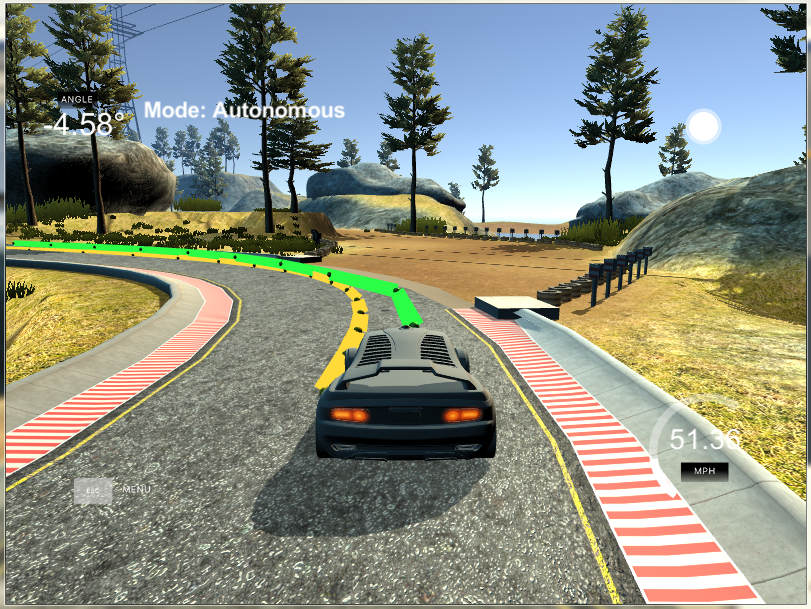 *MPC*


# Overview of the Project
---
In this project and MPC controller is used to control vehicle actuator to enable a vehicle drive safely in udacity simulator. MPC presents an alternative method to PID control to control vehicle. Control system has an inherent latency between control commands (for actuators) issuance to actually applied. This latency is difficult to model in PID controller. Latency can be easily accomodated in MPC.

According to [Wikipedia](https://en.wikipedia.org/wiki/Model_predictive_control) (with slight edits):

> Model predictive control (MPC) is an advanced method of process control that is used to control a process while satisfying a set of constraints. It has been in use in the process industries in chemical plants and oil refineries since the 1980s.

> Model predictive controllers rely on dynamic models of the process, most often linear empirical models obtained by system identification. The main advantage of MPC is the fact that it allows the current timeslot to be optimized, while keeping future timeslots in account. This is achieved by optimizing a finite time-horizon, but only implementing the current timeslot and then optimizing again. Also MPC has the ability to anticipate future events and can take control actions accordingly. PID controllers do not have this predictive ability. MPC is nearly universally implemented as a digital control, although there is research into achieving faster response times with specially designed analog circuitry.


The MPC consists of deriving states for vehicle motion and actuators, applying a cost function and then using a non-linear optimizer to get values for state parameters for a defined time horizon. Only the first of the predicted actuators from state is applied to vehicle and then the process is repeated. 

Section below describes how MPC works:

## Steps in MPC

1. Set N and dt.
2. Fit the polynomial to the waypoints.
3. Calculate initial cross track error and orientation error values.
4. Define the components of the cost function 
5. Define the model constraints.
6. Run optimizer
7. Pass actuator predicted actuator values to vehicle and Repeat step 6 at each time step


## Components of MPC

Below each of the steps are described in detail.

### Vehicle Model,State vector, Cost and Constraints setup
---

### Kinematic Motion Model
---
Bicycle model is used to model vehicle motion. Here is the formula for next state:
 
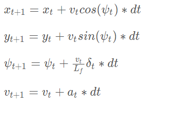 
*	Parameter Lf is called turning radius. It is obtained by measuring the radius formed by running the vehicle in the  simulator around in a circle with a constant steering angle and velocity on a flat terrain. Lf is tuned until the the radius formed by the simulating the model matched the previous radius.This is the length from front to CoG that has a similar radius. The value of Lf for vehicle in simulator is **2.67**. 


### Prediction Horizon(Set N and dt)
---
Prediction horizon(T) to consider for MPC is defined using a integer number (N) and time delta(dt). The prediction horizon is the duration over which future predictions are made.It is the product of two variables, N and dt.N is the number of timesteps in the horizon. dt is how much time elapses between actuation's. For example, if N were 20 and dt were 0.5, then T would be 10 seconds. N and dt are hyperparameters.In the case of driving a car, T should be a few seconds, at most. Beyond that horizon, the environment will change enough that it won't make sense to predict any further into the future. N controls computation cost and dt controls accuracy of model. 

### Motion and Actuation Parameters
---
Vehicle parameters x and y positions,heading direction,velocity are part of state vector. Control inputs are actuators which are steering angle and throttle. Throttle represents both acceleration (positive) and braking(negative).
 
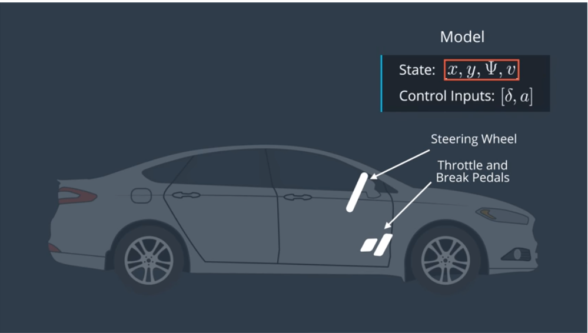 


### Polynomial Fitting and MPC Preprocessing
---
The waypoints to estimate the road curves is given with map's coordinate system,which is different than the car's coordinate system.Transforming these waypoints  makes it easier to both display them and to calculate the CTE and Epsi values for the MPC.The waypoints are subtracted from vehicle's actual position and transformed using Homogenous transform to align with trajectory (x-axis is cars heading direction).

The reference trajectory is derived using a polynomial function. 3rd order  is suggested as good order to represent most vehicle paths(road) as polynomial.

Polynomial fitting is implemented with solution adapted from [Polyfit](https://github.com/JuliaMath/Polynomials.jl/blob/master/src/Polynomials.jl#L676-L716)

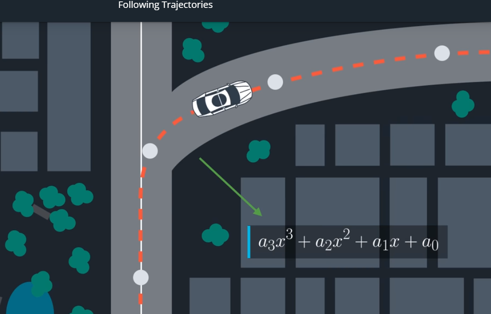 

The coefficients derived from the polyfit of waypoints is used to calculate CTE and heading direction error as described in section below. These coefficients are also used in this project to display reference trajectory and MPC calculated trajectory.

### Error and Following Trajectory
---
The vehicle has to follow a trajectory that means Cross track error and heading direction error are also parameters in state vector, So, we have 6 parameters in state vector.

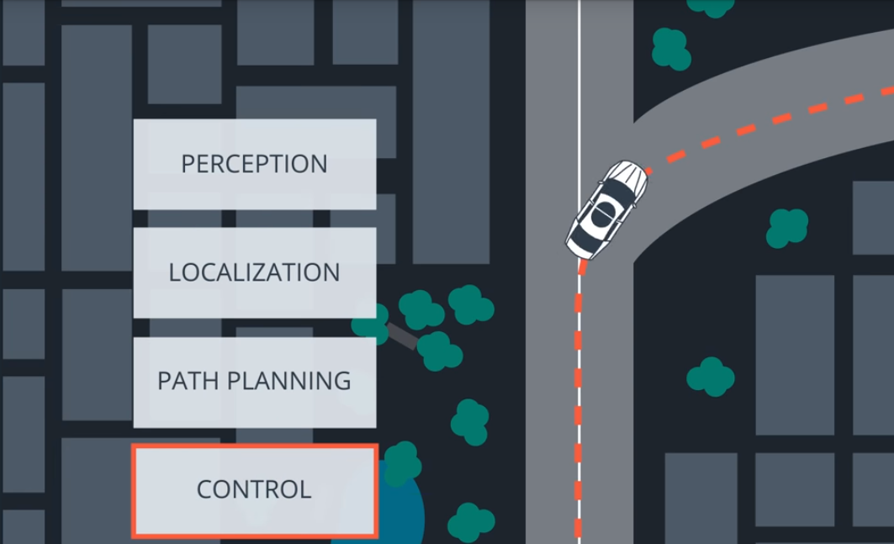 


We can express these errors as difference between desired and actual position and heading:

*	Cross track error(CTE) is the difference between desired position and actual position. It can be obtained from  difference of actual position(y(t) and fitted polynomial(desired/reference path) f(x(t) and adding the change in error caused by the vehicle's movement.
 
		cte(t+1)= y(t) - f(x(t))+v(t)*sin(epsi(t))*dt
*	Orientation error(eψ) is the desired orientation subtracted from the current orientation

	eψ(t)=ψ(t)−ψdes(t)

We already know ψ(t), because it’s part of our state. We don’t yet know ψdes(t)(desired psi) - all we have so far is a polynomial to follow. ψdes(t) can be calculated as the tangential angle of the polynomial f evaluated at x(t), arctan(f′(x(t)). f′ is the derivative of the polynomial.

	eψ(t+1)=eψ(t)+v(t)/Lf∗δ(t)∗dt

	δ(t) being current steering angle


### Ipopt
---
The Optimizer,[Ipopt](https://projects.coin-or.org/Ipopt), used in the MPC uses a cost function to optimize trajectory of the vehicle.The actuator values predicted by optimizer are passed to vehicle.

	Syntax for optimizer in Ipopt is
  	  *# include <cppad/ipopt/solve.hpp>
  	  ipopt::solve(
       options, xi, xl, xu, gl, gu, fg_eval, solution
  	  )

  	  Purpose
  	  The function ipopt::solve solves nonlinear programming problems of the form
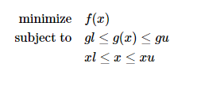

	Arguements passed to solve method are:
	options: options for optimizer
	xi     : It specifies the initial point where Ipopt starts the optimization process (state vector+actuators) 
	xl     : It specifies the lower limits for the argument in the optimization problem
	xu     : It specifies the upper limits for the argument in the optimization problem
	gl	   : It specifies the lower limits for the constraints in the optimization problem (actual-desired)
	gu	   : It specifies the upper limits for the constraints in the optimization problem (actual-desired)
	fg_eval: The argument fg_eval has prototype 
			FG_eval fg_eval
			where the class FG_eval is unspecified except for the fact that it supports the syntax 
     		FG_eval::ADvector fg_eval(fg, x)
	
	solution: After the optimization process is completed, solution contains results and status

	the first element[0] of ADvector fg is cost function and next nb_state_params are model constraints(actual-desired)
	x is the the vector with state params and actuator values
	Size of xi,xl,xu is size of N*nb_state_params+ (N-1)*nb_actuators
	Size of gl,gu is N*nb_state_params


### Cost Function
---
A good start to the cost function is to think of the error that we would like to minimize. For example, measuring the offset from the center of the lane, where the center of the lane can be called the reference, or desired, state.We previously captured two errors in our state vector: CTE and eψ.

Ideally, both of these errors should be 0 - there would be no difference from the actual vehicle position and heading to the desired position and heading.Our cost should be a function of how far these errors are from 0.

In addition to cte and heading error, velocity can be specified as cost. we want to go as fast as we can. Difference between current velocity and desired velocity (chosen as 100 MPH in this project) is added to cost.

There are other consideration while driving a vehicle such as:

* Minimize use of actuators (steering and throttle)
* For smooth driving, steering and throttle changes shouldn't be drastic between successive time steps
* Slow down vehicle when cte is high
* Don't accelerate when velocity is high (close to desired velocity)


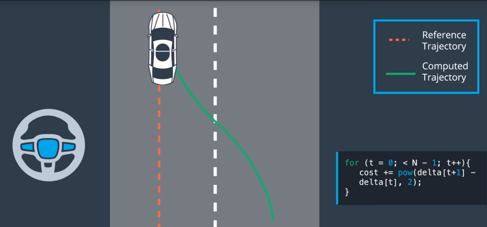

**Cost function is weighted sum of all the above costs.The weights are tuned manually and denote their importance for optimization, ex: cte is assigned highest weight**

### Constraints and Limits on state parameters
---
Total number of variables passed to optimizer are:

	N * nb_state_params + (N - 1) * nb_actuators
	i.e. N * nb_state_params for state variable (px[0:N-1],py,v,cte,epsi)
	and (N - 1) * nb_actuators for actuators


Optimizer also needs to be provided limits of acceptable values for variables.State variables are assigned bounds of +/1.0e19. The steering angle is assigned bound of +/0.436332 (max turn of 25 degrees) and throttle +/1.0. 

The initial value pf model constraints are assigned value of the current state vector parameters and 0 for others.


### MPC loop
---
With all the parameters,constraints and cost function setup, optimizer is run which returns optimized value of state vector and actuators (size of variable passed).
The first value of throttle and steering angle is passed to vehicle, and other values are discarded. Then the optimizer is restarted at next time step and the process is repeated until vehicle is stopped.

* Input
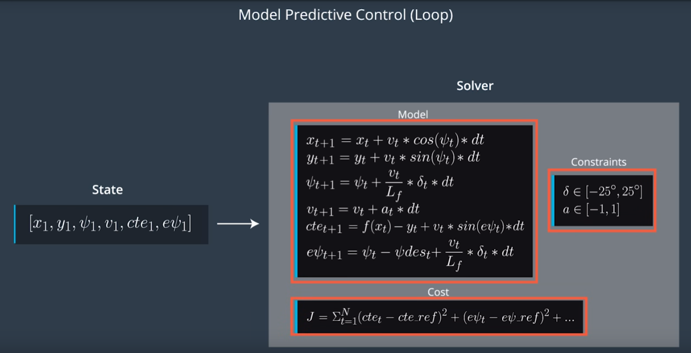

* Outputs
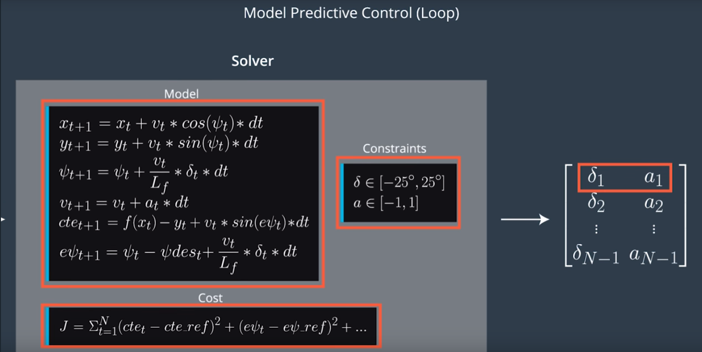

* MPC trajectory


### Latency
---
The simulator has a latency of 100ms between actuator command and application.To account for this, we add an estimation of where vehicle will be in 100ms based on current velocity,steering value and throttle value to initial state before passing the values to optimizer.
	
	current_px = 0.0 + v * dt_latency;
	current_py = 0.0 ;
	current_psi = 0.0 + v * (-steer_value) / Lf * dt_latency;
	current_v = v + throttle_value * dt_latency;
	current_cte = cte + v * sin(epsi) * dt_latency;
	current_epsi = epsi + v * (-steer_value) / Lf * dt_latency;


# Implementation
---
The C++ code used in this implementation can be found in [src](./src) directory.

1. File globals.h contains definition of all the constants used in this project such as Lf,number of state and actuator variables,reference velocity,cte and steering error,span of different state variables in the variables vector,weights for cost function and degree of polynomial.
2. The file MPC.h is header file for MPC class.
3. The file MPC.cpp defines function Solve prototyped in MPC.h and also implements  FG_eval class that is passed as fg_eval to Ipopt optimizer.
	1. Solve function of class MPC, sets up optmization variables vector, upper and lower bound on this vector and upper and lower bounds on model constraints. Optimizer is then called and first value of actuators and predicted x and y positions are returned to main function.
	2. FG_eval class is also implemented in MPC.cpp. This class is passed to optimizer with () operator overloaded. In this Class, cost function and model constraints are setup. 
4. The file main.cpp file has main function. The interaction with simulator happens in the main function.polyfit and polyeval functions are defined in this file which are used for polynomial fitting and coefficient calculation.
In the main function, for each call of simulator (at a time step),current values of position,heading direction,speed,steering angle and throttle is captured. Waypoints are mapped to vehicle's co-ordinate system and homogenous transform is applied to align waypoints and vehicle's position.Transformed waypoints are then used to generate polynomial coefficients. State vector is then built applying estimation to compensate for latency. Next Solve function from MPC class is called which runs optimizer and returns first actuator value (steering angle and throttle). The steering value is converted to degrees and passed to simulator along with throttle value. 

NOTE: If δ is positive we rotate vehicle counter-clockwise, or turn left. In the simulator however, a positive value implies a right turn and a negative value implies a left turn, so steering value is negated before passing to simulator.

The MPC::Solve function also returns predicted trajectory from optimizer, using coefficient calculated from polyfit, a reference trajectory and predicted trajectory are passed to the simulator to draw reference and predicted trajectory in simulator, which helps in visualization and tuning of weights for cost function.

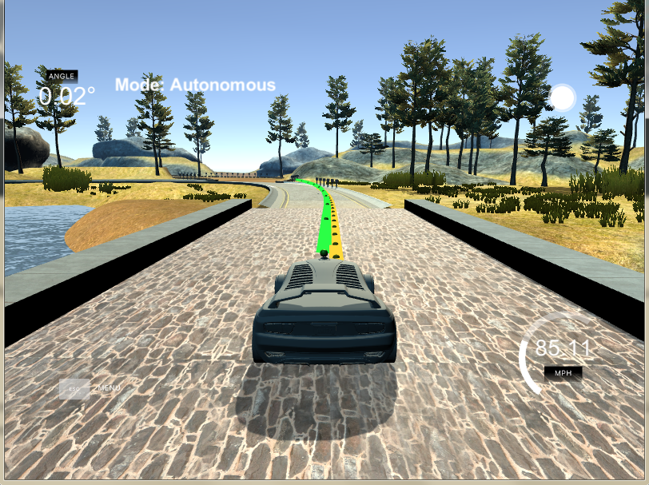

## Hyperparameter Tuning
---
The tuned hyperparameters in this project are:

* N and dt: First set N=5 and dt=0.1 but predicted trajectory looked very short and high cte was observed. Increased N to 15 cte didn't improve, probably optimizer ran out of time, increasing optmizer parameter Numeric max_cpu_time to 1 helped but not by much. Finally, settled at N=10 and dt=0.1
* ref_v: This is desired (max) velocity, started with 40 and when cte were manageable increased to 100 and then to 200. Max speed achieved is **~95MPH** , it is set at 100 in submitted code.
* weights for cost function: the weights for cost functions are manually tuned. There is orders of magnitude difference between weights showing importance placed on each cost function component.
	* cte_w	   : weight for cte minimization(highest weight) set at 2000
	* epsi_w   : weight for heading error minimization (set at 1000)
	* v\_w      : weight for getting speed close to ref_v (set at 0.5)
	* delta_w  : weight to minimize steering angle change (set at 1.0)
	* a_w      : weight to minimize throttle change (set at 0.5)
	* delta\_s\_w: weight for smooth angle change between subsequent steps (set at 40)
	* a\_s\_w    : weight for smooth throttle between subsequent steps (set at 2)
	* cte\_v\_w  : weight for reducing velocity when high cte (cte*speed) (set at 0.1, lowest cost)
	* delta_v\_w: weight for reducing acceleration when speed is high (throttle*speed) (set at 10)	


# Result
---
The implemented MPC is able to achieve ~95MPH max speed which is quite a boost over PID controller(~70 MPH).

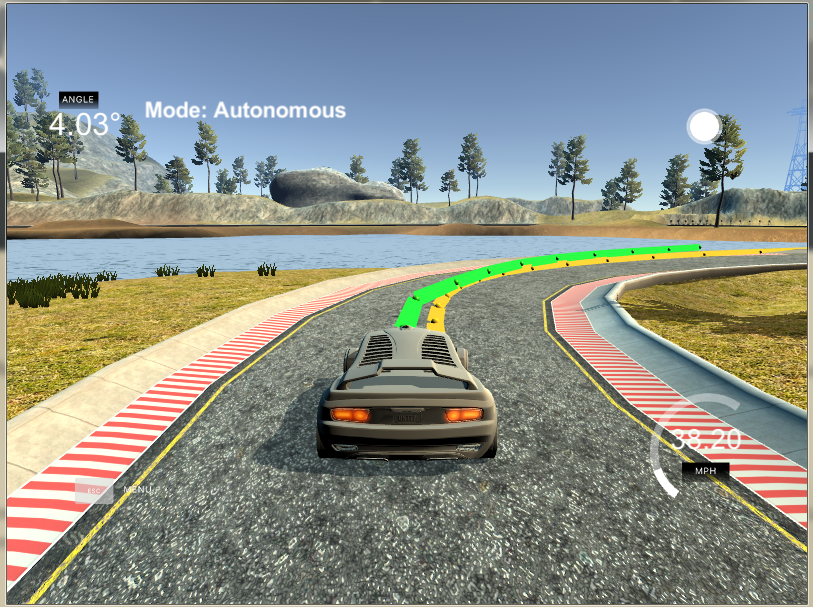

Here is vehicle run around simulator track for 3 laps:

 


# Source Code, Compilation and Run
--- 
To compile and run the MPC project code, following steps are required:

1. Make a build directory: `mkdir build && cd build`
2. Compile: `cmake .. && make`
3. Run it: `./mpc`.
4. open unity Simulator, choose MPC  and run


# Reference
---
[John Rossiter
 on Youtube](https://www.youtube.com/watch?v=4kCcXGDvjU8&list=PLs7mcKy_nInFEpygo_VrqDFCsQVnGaoy-)

## Dependencies

* cmake >= 3.5
 * All OSes: [click here for installation instructions](https://cmake.org/install/)
* make >= 4.1(mac, linux), 3.81(Windows)
  * Linux: make is installed by default on most Linux distros
  * Mac: [install Xcode command line tools to get make](https://developer.apple.com/xcode/features/)
  * Windows: [Click here for installation instructions](http://gnuwin32.sourceforge.net/packages/make.htm)
* gcc/g++ >= 5.4
  * Linux: gcc / g++ is installed by default on most Linux distros
  * Mac: same deal as make - [install Xcode command line tools]((https://developer.apple.com/xcode/features/)
  * Windows: recommend using [MinGW](http://www.mingw.org/)
* [uWebSockets](https://github.com/uWebSockets/uWebSockets)
  * Run either `install-mac.sh` or `install-ubuntu.sh`.
  * If you install from source, checkout to commit `e94b6e1`, i.e.
    ```
    git clone https://github.com/uWebSockets/uWebSockets
    cd uWebSockets
    git checkout e94b6e1
    ```
    Some function signatures have changed in v0.14.x. See [this PR](https://github.com/udacity/CarND-MPC-Project/pull/3) for more details.

* **Ipopt and CppAD:** Please refer to [this document](https://github.com/udacity/CarND-MPC-Project/blob/master/install_Ipopt_CppAD.md) for installation instructions.
* [Eigen](http://eigen.tuxfamily.org/index.php?title=Main_Page). 
* [Simulator](https://github.com/udacity/self-driving-car-sim/releases).
* Not a dependency but read the [DATA.md](./DATA.md) for a description of the data sent back from the simulator.


## Other Tips

1. The `lake_track_waypoints.csv` file has the waypoints of the lake track. I have captured position from simulator with  MPC controller in [file](./lake_track_waypoints_MPC_points.csv)
The shape of waypoints and points from MPC match when plottes as scatter plot in excel.

* Waypoint and MPC points (px vs py),velocity and steering plots


* Waypoints and MPC points (px vs py) overlaid in scatter plot


 
2. For visualization this C++ [matplotlib wrapper](https://github.com/lava/matplotlib-cpp) could be helpful.)


## Code Style

Plan to follow [Google's C++ style guide](https://google.github.io/styleguide/cppguide.html).

## Project Instructions and Rubric
see [the project page](https://classroom.udacity.com/nanodegrees/nd013/parts/40f38239-66b6-46ec-ae68-03afd8a601c8/modules/f1820894-8322-4bb3-81aa-b26b3c6dcbaf/lessons/b1ff3be0-c904-438e-aad3-2b5379f0e0c3/concepts/1a2255a0-e23c-44cf-8d41-39b8a3c8264a)
for instructions and the project rubric.


